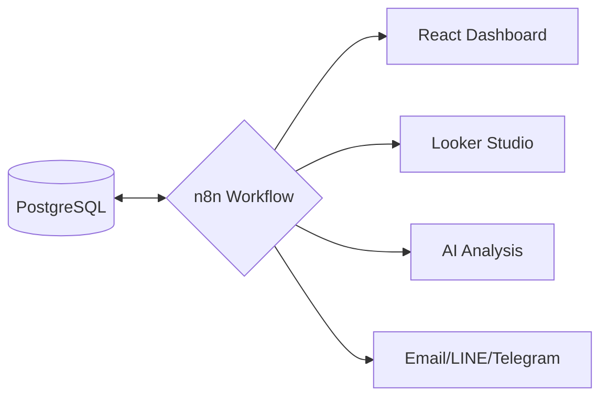

# n8n Dashboard & Automation Strategy

## 1. Overview
n8n is a low-code workflow automation tool that can serve as a powerful middleware for the CSC Circular system. Instead of building every complex aggregation or integration into the Node.js backend, we can offload these tasks to n8n.

## 2. Implementation Strategies

### Strategy A: Data Aggregator (ETL)
n8n acts as an ETL (Extract, Transform, Load) tool to process raw database records into "Ready-to-Visualize" formats.
- **Process**: n8n queries the PostgreSQL database -> Aggregates statistics (e.g., by month, by agency) -> Stores the result in a dedicated `dashboard_summaries` table.
- **Benefit**: Reduces the calculation load on the main API server.

### Strategy B: Low-Code Backend (Webhook)
Use n8n to expose custom API endpoints for specific dashboard widgets.
- **Process**: React Frontend calls an n8n Webhook -> n8n performs logic (possibly including AI analysis via LLM nodes) -> Returns JSON to React.
- **Benefit**: Rapidly prototype new dashboard features without modifying the core server code.

### Strategy C: External Visualization Integration
Sync data with external professional dashboard tools.
- **Process**: n8n pulls data from Postgres -> Syncs with **Google Looker Studio**, **Grafana**, or **Google Sheets**.
- **Benefit**: Provides advanced charts, filters, and reporting capabilities that are expensive to build manually in React.

## 3. Recommended Use Cases for CSC Circular

### 🤖 AI-Powered Insights
- Use n8n's **AI nodes** (OpenAI/Mistral) to analyze the "Detail" of circulars and automatically categorize them or summarize the overall trend of CSC decisions.

### 📧 Automated Executive Reports
- A weekly workflow that generates a PDF summary of new circulars and adoption status, then emails it to stakeholders or sends a notification via **LINE/Telegram**.

### 📊 External Agency Tracking
- Automatically monitor external websites for new circulars and alert the admin team to update the system.

## 4. Architecture Diagram

## 5. Security & Best Practices
- **Credential Management**: Use n8n's internal credential system to store DB keys safely.
- **Resource Limit**: Schedule heavy workflows during off-peak hours (e.g., 2:00 AM).
- **API Keys**: Secure n8n Webhooks with Header Authentication to ensure only our React frontend can access them.
