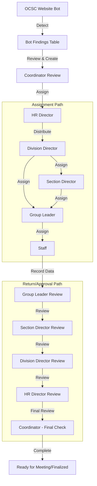

# OCSC Circular Workflow & Bot System Design

This document outlines the proposed system architecture for automating the OCSC circular letter detection and the multi-level assignment/approval workflow.

## 1. Role Definitions & Hierarchy

We will expand the current `a_permiss` system into a more granular `a_role` system.

| Role Key | Role Name (TH) | Responsibilities |
| :--- | :--- | :--- |
| `SUPERADMIN` | ผู้ดูแลระบบสูงสุด | Manage users, master data, and system settings. |
| `COORDINATOR` | เจ้าหน้าที่บริหารการพิจารณา | Manage Bot findings, create official circulars, and start the workflow. |
| `HR_DIRECTOR` | ผอ. ศูนย์สารสนเทศฯ | Initial receiver; distributes to relevant Division Directors. |
| `DIV_DIRECTOR` | ผอ. กอง | Assigns to Section Director or Group Leader within their division. |
| `SEC_DIRECTOR` | ผอ. ส่วน | Assigns to Group Leader within their section. |
| `GRP_LEADER` | หัวหน้ากลุ่มงาน/ฝ่าย | Assigns to Staff for data entry; first level of review. |
| `STAFF` | เจ้าหน้าที่กลุ่ม | Records circular data and results. |

## 2. Database Schema Enhancements

### 2.1 Table: `admin` (Existing - Updated)
Add fields for hierarchy and role.
```sql
ALTER TABLE admin ADD COLUMN a_role VARCHAR(50); -- Role Key
ALTER TABLE admin ADD COLUMN a_parent_id INTEGER; -- For reporting hierarchy
ALTER TABLE admin ADD COLUMN a_position VARCHAR(255); -- Official Position Title
```

### 2.2 Table: `c_workflow_history` (New)
To track every move and comment.
```sql
CREATE TABLE c_workflow_history (
    wh_id SERIAL PRIMARY KEY,
    in_id INTEGER REFERENCES c_information(in_id),
    from_user_id INTEGER REFERENCES admin(a_id),
    to_user_id INTEGER REFERENCES admin(a_id),
    status_from VARCHAR(50),
    status_to VARCHAR(50),
    action_note TEXT,
    created_at TIMESTAMP DEFAULT NOW()
);
```

### 2.3 Table: `c_bot_findings` (New)
Queue for the Bot.
```sql
CREATE TABLE c_bot_findings (
    bot_id SERIAL PRIMARY KEY,
    bot_title TEXT,
    bot_url TEXT UNIQUE,
    bot_date DATE,
    bot_status VARCHAR(20) DEFAULT 'PENDING', -- PENDING, IMPORTED, IGNORED
    created_at TIMESTAMP DEFAULT NOW()
);
```

### 2.4 Table: `c_information` (Existing - Updated)
```sql
ALTER TABLE c_information ADD COLUMN in_workflow_status VARCHAR(50) DEFAULT 'DRAFT';
ALTER TABLE c_information ADD COLUMN in_current_owner_id INTEGER REFERENCES admin(a_id);
```

## 3. Workflow State Machine



## 4. Bot Strategy (OCSC Scraper)

1.  **Technology**: Node.js script using `axios` (for API/HTML) and `cheerio` (for parsing).
2.  **Logic**:
    *   Fetch the OCSC circular page (e.g., `ocsc.go.th/circular`).
    *   Compare titles/URLs with existing records in `c_bot_findings` and `c_information`.
    *   If new, insert into `c_bot_findings`.
    *   Trigger a system notification (or email) to the Coordinator.
3.  **Schedule**: Run every 6 hours via Cron or `node-cron`.

## 5. User Interface Updates

*   **Coordinator Dashboard**: A new section to "Approve Bot Findings".
*   **Inbox/Task List**: Each user role will see a "Pending Tasks" list showing circulars where `in_current_owner_id` is them.
*   **Assignment Modal**: A dynamic modal to select subordinates based on `a_parent_id` and `a_agency`.
